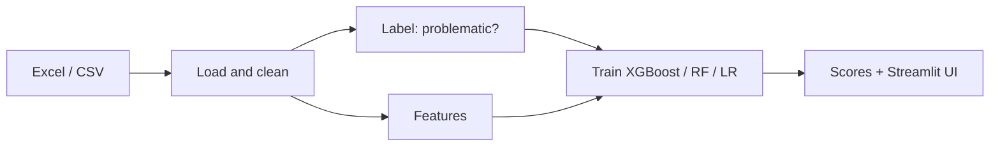

# Planning Application Issue Detector

Machine learning pipeline to help identify **problematic Irish planning applications** — for example those with very long processing times or refusals — so councils can prioritise review and resources.

The original work lived in a single [Google Colab notebook](Irish_Planning_Data_Ireland_Cloud_Version_No_API.ipynb). This repository now adds a **reproducible Python package**, **CLI**, **Streamlit demo**, and **CI tests**.


## Quick start

```bash
python3 -m venv .venv
source .venv/bin/activate
pip install -e ".[app,dev]"

# Train on bundled sample data (or set PLANNING_DATA_PATH to your Excel file)
export PLANNING_DATA_PATH=data/sample/planning_applications_sample.csv
planning-train

# Interactive demo
streamlit run streamlit_app.py
```

## Deploy on Streamlit Community Cloud

1. Push this repo to GitHub.
2. Go to [share.streamlit.io](https://share.streamlit.io) and **Create app**.
3. Set **Main file path** to `streamlit_app.py` and **Requirements** to `requirements.txt` (default).
4. Deploy. The app auto-trains on the bundled sample data on first visit (ephemeral disk on Cloud).

Optional **Secrets** (Settings → Secrets), see [`.streamlit/secrets.toml.example`](.streamlit/secrets.toml.example):

```toml
PLANNING_DATA_PATH = "data/sample/planning_applications_sample.csv"
```

[](https://share.streamlit.io)

## Full dataset

Download or export `Tableau_Ready_Planning_Applications_With_Street_Town_Cleaned.xlsx` and either:

- Place it in the repo root, or
- `export PLANNING_DATA_PATH=/path/to/file.xlsx`

See [data/README.md](data/README.md).

## How it works



### Defining “problematic”

Configure in [`configs/default.yaml`](configs/default.yaml):

| `label_mode` | Meaning |
|--------------|---------|
| `delay` | Processing time &gt; `threshold_days` (default 180) |
| `refusal` | Decision is Refused |
| `either` | Delay or refusal |

### Avoiding misleading accuracy

The Colab notebook often used **processing time both as the label and as a feature**, which inflates accuracy.

| `feature_set` | Use when |
|---------------|----------|
| **`early`** (default) | Authority + application type only — suitable for honest evaluation |
| **`full`** | Includes `processing_time_days` — **retrospective analysis only** ([`configs/retrospective.yaml`](configs/retrospective.yaml)) |

Metrics reported after training include accuracy, precision, recall, F1, and ROC-AUC when applicable (`models/metrics.json`).

## Project layout

```
├── src/planning_detector/   # Package: load, features, labels, train, predict
├── configs/                 # YAML pipeline settings
├── data/sample/             # Synthetic sample CSV for tests and demos
├── streamlit_app.py         # Web UI
├── models/                  # Trained artifacts (gitignored)
├── notebooks/               # Focused notebooks (legacy Colab export at repo root)
└── tests/
```

## CLI

```bash
planning-train --data path/to/data.xlsx
planning-train --config configs/retrospective.yaml

planning-predict data/sample/planning_applications_sample.csv --output scores.csv
```

## Development

```bash
make install
make test
make lint
make train
make app
```

## Legacy notebook

[`Irish_Planning_Data_Ireland_Cloud_Version_No_API.ipynb`](Irish_Planning_Data_Ireland_Cloud_Version_No_API.ipynb) remains as the historical Colab export (NLP, T5 summarisation, GridSearch). New work should use the package under `src/planning_detector/`.

## Licence

MIT (see repository settings if not yet added).
